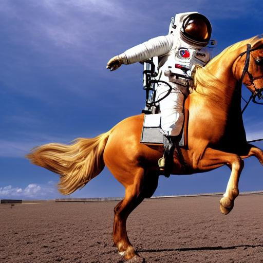

# Stable Diffusion through TFLite
This example shows how to use the Edge Generative API to convert a PyTorch Stable Diffusion v1.5 model to TFLite model, and run the image generation inference.

## Convert PyTorch to TFLite model
1. Download PyTorch stable diffusion model [stable-diffusion-pytorch](https://github.com/kjsman/stable-diffusion-pytorch)
1. Unzip the downloaded model weight into `$HOME/Downloads/stable_diffusion_data`
1. Run `convert_to_tflite.py`. This will convert the PyTorch models into TFLite models. The stable diffusion model has four components: CLIP (text embedding), encoder, diffusion and decoder models. Each component is converted to a single TFLite model file.

## Run Stable Diffusion pipeline
1. Use `run_tflite_pipeline` method in `pipeline.py` to trigger the end-to-end stable diffusion pipeline with TFLite model. See the example usage in `pipeline.py` as a script.

Here is an example generated image.

Prompt: "a photograph of an astronaut riding a horse"

